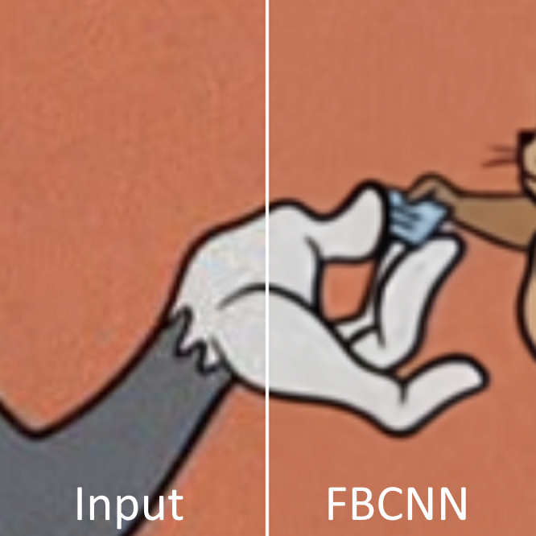

# JPEG Artifact Correction

Correction of visual artifacts caused by JPEG compression, these artifacts are usually grouped into three types: blocking, blurring, and ringing. They are caused by quantization and removal of high frequency DCT coefficients:

The image inputs are taken from the [Huggingface FBCNN](https://huggingface.co/spaces/danielsapit/JPEG_Artifacts_Removal) page, from the example images.
  
## Tom And Jerry

<ImageSliderGithub :key="componentKey" inputImageURL='https://raw.githubusercontent.com/Phhofm/upscale/main/sources/output/lossless/artifactsremoval/tomandjerry/input.webp' relativePathOutputFolder='output/lossless/artifactsremoval/tomandjerry'/>

<button v-if="fullscreenEnabled" @click="enterFullscreen('tomandjerryExample')" style="color:mediumseagreen;"><strong>FULLSCREEN (Exit with ESC)</strong></button> 
<button v-if="fullscreenEnabled" @click="forceRerender()" style="color:mediumseagreen;"><strong>Reset examples</strong></button>  
 

  
Details

  

Input Image: [Image](https://github.com/Phhofm/upscale/blob/main/sources/output/lossless/artifactsremoval/tomandjerry/input.webp)

Output Images: [Github Folder](https://github.com/Phhofm/upscale/tree/main/sources/output/lossless/artifactsremoval/tomandjerry)

  

## Gate 2

<ImageSliderGithub :key="componentKey" inputImageURL='https://raw.githubusercontent.com/Phhofm/upscale/main/sources/output/lossless/artifactsremoval/gate2/input.webp' relativePathOutputFolder='output/lossless/artifactsremoval/gate2'/>

<button v-if="fullscreenEnabled" @click="enterFullscreen('gate2Example')" style="color:mediumseagreen;"><strong>FULLSCREEN (Exit with ESC)</strong></button> 
<button v-if="fullscreenEnabled" @click="forceRerender()" style="color:mediumseagreen;"><strong>Reset examples</strong></button>  
 

  
Details

  

Input Image: [Image](https://github.com/Phhofm/upscale/blob/main/sources/output/lossless/artifactsremoval/gate2/input.webp)

Output Images: [Github Folder](https://github.com/Phhofm/upscale/tree/main/sources/output/lossless/artifactsremoval/gate2)

  

