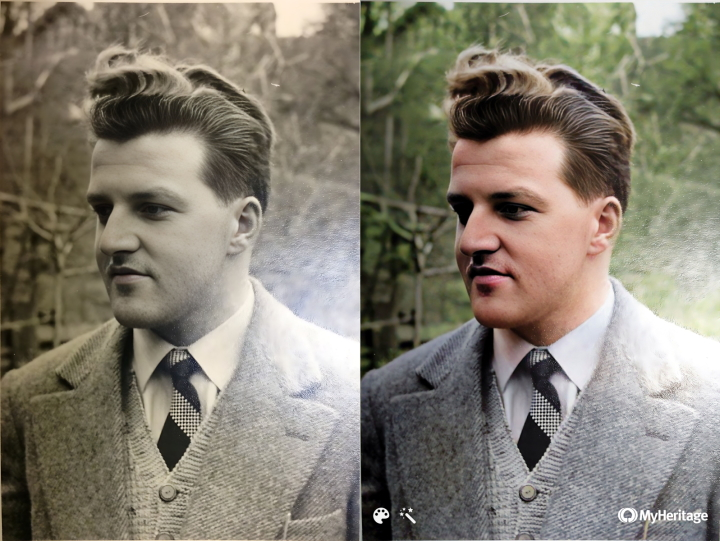

# Colorization

Colorization is the process of adding plausible color information to monochrome photographs:

The image inputs are photos of my grandfather, Willy Burri. He had passed away when my mother was around 12 years old.

Output info:

The outputs beginning with '1x' are ESRGAN (architecture) models that can be used with [chaiNNer](https://github.com/chaiNNer-org/chaiNNer) and are from the [upscale wiki model database](https://upscale.wiki/wiki/Model_Database).  

[BigColor](https://github.com/KIMGEONUNG/BigColor) ([Project Page](https://kimgeonung.github.io/bigcolor/)) is its own architecture and can be used on [replicate](https://replicate.com/cjwbw/bigcolor). It will output multiple image outputs from a single input image process, so I simply numbered the outputs (1-5). These are not different models but simply different outputs from a single processing run from a single input image. 

[DeOldify](https://github.com/jantic/DeOldify) ([Project Page](https://deoldify.ai/)) is also its own architecture and can be run with a render factor which I appended to the output. The special thing here is that on the github repo we find two different models, the artistic model which will produce more interesting colors but have glitches (notice the grey hand in the couples image output) and can be run on this [google colab](https://colab.research.google.com/github/jantic/DeOldify/blob/master/ImageColorizerColab.ipynb), and there is a stable model which reduces glitches (but less 'artistic' colors) and can be run on this [google colab](https://colab.research.google.com/github/jantic/DeOldify/blob/master/ImageColorizerColabStable.ipynb). Both models can also be run on [replicate](https://replicate.com/arielreplicate/deoldify_image) or on the windows desktop app [DeOldify.NET](https://github.com/ColorfulSoft/DeOldify.NET). There is a render factor which I appended to the output name, so 'deoldify_artistic_35' means I used the DeOldify with the artistic model and a render factor of 35. Then there is a version of DeOldify which in contrast to the open source version received updates/improvements but its not open source, continual development happened exclusively for the version hosted on [MyHeritage In Color](https://www.myheritage.ch/incolor).
  
## Portrait

<ImageSliderGithub :key="componentKey" inputImageURL='https://raw.githubusercontent.com/Phhofm/upscale/main/sources/colorization/input/portrait.webp' relativePathOutputFolder='colorization/portrait'/>

<button v-if="fullscreenEnabled" @click="enterFullscreen('portraitExample')" style="color:mediumseagreen;"><strong>FULLSCREEN (Exit with ESC)</strong></button> 
<button v-if="fullscreenEnabled" @click="forceRerender()" style="color:mediumseagreen;"><strong>Reset examples</strong></button>  
 

  
Details

  

Input Image: [Image](https://github.com/Phhofm/upscale/blob/main/sources/colorization/input/portrait.webp)

Output Images: [Github Folder](https://github.com/Phhofm/upscale/tree/main/sources/colorization/portrait)

  

## Couple

<ImageSliderGithub :key="componentKey" inputImageURL='https://raw.githubusercontent.com/Phhofm/upscale/main/sources/colorization/input/couple.webp' relativePathOutputFolder='colorization/couple'/>

<button v-if="fullscreenEnabled" @click="enterFullscreen('coupleExample')" style="color:mediumseagreen;"><strong>FULLSCREEN (Exit with ESC)</strong></button> 
<button v-if="fullscreenEnabled" @click="forceRerender()" style="color:mediumseagreen;"><strong>Reset examples</strong></button>  
 

  
Details

  

Input Image: [Image](https://github.com/Phhofm/upscale/blob/main/sources/colorization/input/couple.webp)

Output Images: [Github Folder](https://github.com/Phhofm/upscale/tree/main/sources/colorization/couple)

  

