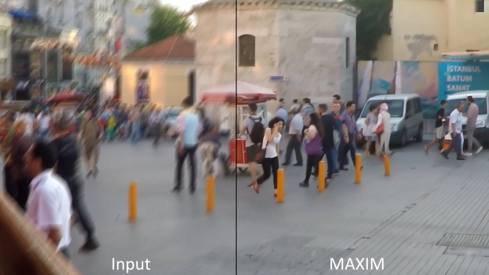

# Deblurring

Deblurring is the process of removing blur from an image as shown in this example:

  

PS Outputs have been saved in lossy jpg so compression occurred

### Details

  Creation Date: 24. Nov 2022  
  Last Update: 25. Nov 2022  
  Models used: 23
  Set Name: 'Deblur'  

  

    
Models List

      1x-Focus  
      1x-Focus_Moderate  
      1x_ArtClarity  
      1x_ArtClarity_strong  
      1x_DeBLR  
      1x_Fatality_DeBlur_270000_G  
      1x_mdeblur  
      1x_PixelSharpen_100000  
      1x_ReFocus_Cleanly_100000_G  
      1x_ReFocus_V3_140000_G  
      1x_ThePi7on-Solidd_Deborutify_UltraLite_260k_G  
      1x_UnResize_V3_200000_G  
      IFAN  
      Restormer_Defocus_Deblur  
      Restormer_Motion_Deblurring  
      MAXIM_GoPro  
      MAXIM_RealBlur_J  
      MAXIM_RealBlur_R  
      MAXIM_REDS  
      NAFNet_GoPro  
      NAFNet_REDS  
      DeblurGANv2_MobileNet  
      DeblurGANv2_InceptionResNet-v2  

  

## GoPro

These three example images are taken from the [GoPro Large Testset](https://seungjunnah.github.io/Datasets/gopro). GOPRO_Large dataset is proposed for dynamic scene deblurring. Training and Test set are publicly available.

### Example 1

<ImageSliderGithub :key="componentKey" inputImageURL='https://raw.githubusercontent.com/Phhofm/upscale/main/sources/deblur/GOPRO_Large/test/GOPR0384_11_00/000001.jpg' relativePathOutputFolder='deblur/GOPRO_Large/test/GOPR0384_11_00/output'/>

<button v-if="fullscreenEnabled" @click="enterFullscreen('firstExample')" style="color:mediumseagreen;"><strong>FULLSCREEN (Exit with ESC)</strong></button> 
<button v-if="fullscreenEnabled" @click="forceRerender()" style="color:mediumseagreen;"><strong>Reset examples</strong></button>  
 

  
Details

  

  Creation Date: 24. Nov 2022
  Last Update: 25. Nov 2022  
  Image Dimensions: 1280x720 pixels  
  Type: Frame  
  Image Files: [Github Repo](https://github.com/Phhofm/upscale/tree/sources/deblur/GOPRO_Large/test/GOPR0384_11_00)

  

  

### Example 2

<ImageSliderGithub :key="componentKey" inputImageURL='https://raw.githubusercontent.com/Phhofm/upscale/main/sources/deblur/GOPRO_Large/test/GOPR0862_11_00/000004.jpg' relativePathOutputFolder='deblur/GOPRO_Large/test/GOPR0862_11_00/output'/>

<button v-if="fullscreenEnabled" @click="enterFullscreen('secondExample')" style="color:mediumseagreen;"><strong>FULLSCREEN (Exit with ESC)</strong></button> 
<button v-if="fullscreenEnabled" @click="forceRerender()" style="color:mediumseagreen;"><strong>Reset examples</strong></button>  
 

  
Details

  

  Creation Date: 24. Nov 2022  
  Last Update: 25. Nov 2022  
  Image Dimensions: 1280x720 pixels  
  Type: Frame  
  Image Files: [Github Repo](https://github.com/Phhofm/upscale/tree/sources/deblur/GOPRO_Large/test/GOPR0862_11_00)

  

  

### Example 3

<ImageSliderGithub :key="componentKey" inputImageURL='https://raw.githubusercontent.com/Phhofm/upscale/main/sources/deblur/GOPRO_Large/test/GOPR0881_11_01/000202.jpg' relativePathOutputFolder='deblur/GOPRO_Large/test/GOPR0881_11_01/output'/>

<button v-if="fullscreenEnabled" @click="enterFullscreen('thirdExample')" style="color:mediumseagreen;"><strong>FULLSCREEN (Exit with ESC)</strong></button> 
<button v-if="fullscreenEnabled" @click="forceRerender()" style="color:mediumseagreen;"><strong>Reset examples</strong></button>  
 

  
Details

  

  Creation Date: 24. Nov 2022  
  Last Update: 25. Nov 2022  
  Image Dimensions: 1280x720 pixels  
  Type: Frame  
  Image Files: [Github Repo](https://github.com/Phhofm/upscale/tree/sources/deblur/GOPRO_Large/test/GOPR0881_11_01)

  

  

