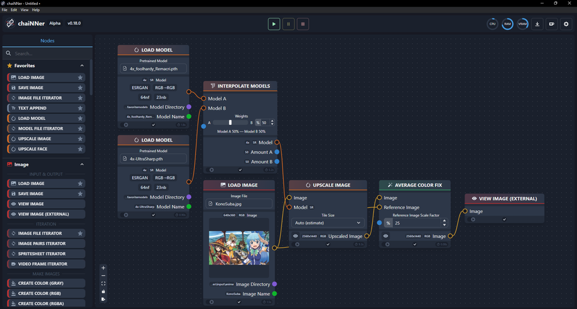

# Interpolated Models

With chaiNNer we can create 'new models' by interpolating (combining the model weights of) two models that share a pretrained model ancestor as illustrated in the image below. I tried out combinations and are providing some the outputs and models here. Since a lot of these interpolated models seem to introduce a slight color shift, I used the average color fix on all of these outputs.

You can download these interpolated models:

[4xInt-Ultracri](https://drive.google.com/file/d/1l7cZSBq-sBMK9gVUG16pJEFcmSJxVu6h/view?usp=sharing) (UltraSharp + Remacri)  
[4xInt-Superscri](https://drive.google.com/file/d/1iy84HEvSJ_PctJmqggkpkrLB7Hbg2M2e/view?usp=sharing) (Superscale + Remacri)  
[4xInt-Siacri](https://drive.google.com/file/d/1VDyB-s6H3uJSQb8-KSmnbpojTr3iMWvc/view?usp=sharing) (Siax + Remacri)  
[4xInt-RemDF2K](https://drive.google.com/file/d/1iI8sHvB6PIGPbGhWEqxfi22LdxR7rRFT/view?usp=sharing) (Remacri + RealSR_DF2K_JPEG)  
[4xInt-RemArt](https://drive.google.com/file/d/16c1jtjLa8q5J4nQb215ag3QBqfw7RAG9/view?usp=sharing) (Remacri + VolArt)  
[4xInt-RemAnime](https://drive.google.com/file/d/1L-SV9Dg-GkJVxA5skMy3ZTIYj7UM3FPk/view?usp=sharing) (Remacri + AnimeSharp)  
[4xInt-RemacRestore](https://drive.google.com/file/d/19-CNzlTibBkk_pdyxKndgPnvLvpHn0oC/view?usp=sharing) (Remacri + UltraMix_Restore)  
[4xInt-AnimeArt](https://drive.google.com/file/d/1-tvb4VBTD2Nb-RvM9iickep_kGpW4Tur/view?usp=sharing) (AnimeSharp + VolArt)  
[2xInt-LD-AnimeJaNai](https://drive.google.com/file/d/1OQeESl-FeqdRSeaxZod7sBpflssapmHX/view?usp=sharing) (LD-Anime + AnimeJaNai)  
  
## Fate interpolated

<ImageSliderGithub :key="componentKey" inputImageURL='https://raw.githubusercontent.com/Phhofm/upscale/main/sources/input/anime/FateStayNightUnlimitedBladeWorksOpening.jpg' relativePathOutputFolder='output/lossless/interpolated/fate'/>

<button v-if="fullscreenEnabled" @click="enterFullscreen('fateExample')" style="color:mediumseagreen;"><strong>FULLSCREEN (Exit with ESC)</strong></button> 
<button v-if="fullscreenEnabled" @click="forceRerender()" style="color:mediumseagreen;"><strong>Reset examples</strong></button>  
 

  
Details

  

Input Image: [Image](https://github.com/Phhofm/upscale/blob/main/sources/input/anime/FateStayNightUnlimitedBladeWorksOpening.jpg)

Output Images: [Github Folder](https://github.com/Phhofm/upscale/tree/main/sources/output/lossless/interpolated/fate)

  

